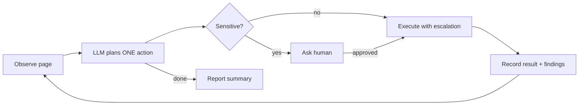

# Browser Agent

An LLM-driven browser agent for shopping and ticket booking. Give it a task in plain English. It opens a real Chromium window and works the site like a person would: searching, clicking, typing and picking options, until the task is done.

What makes it different: **when an action doesn't work, it doesn't give up.** It tries other ways of doing the same thing. If none of them work, it takes a screenshot and asks the vision model which box to click.

```bash
uv run main.py "On amazon.in find a USB-C cable under ₹300 with 4+ stars and add it to the cart"
uv run main.py "Book 2 tickets for the latest English movie in Hyderabad this Saturday evening on BookMyShow"
```

> **You stay in control of money.** The agent always stops and asks for your approval in the terminal before clicking anything like *Pay*, *Place order* or *Confirm booking*.

---

## Quick start

**Requirements:** macOS, Linux or Windows · [uv](https://docs.astral.sh/uv/) · an OpenAI API key. uv installs the Python version the project needs (3.14) automatically.

```bash
# 1. Install dependencies and the Chromium browser
uv sync
uv run playwright install chromium

# 2. Configure
cp .env.example .env        # then put your OPENAI_API_KEY in .env

# 3. Run a task
uv run main.py "search amazon.in for 'usb c cable 1m' and tell me the price of the first non-sponsored result"
```

A browser window opens and you can watch it work. The terminal prints each step: what the agent is thinking, which action it chose and which strategy succeeded.

### First run: log in once

The browser uses a **persistent profile** (`./profile`), so cookies and logins survive between runs. For sites that need an account (Amazon checkout, BookMyShow booking), either:

- let the agent run, and log in by hand when it asks, or
- run `uv run main.py --observe https://www.amazon.in`, log in in the window that opens, then press Enter in the terminal.

After that, the agent reuses your session.

### Command-line options

| Command | What it does |
|---|---|
| `uv run main.py "<task>"` | Run the agent on a task |
| `uv run main.py --max-steps 20 "<task>"` | Limit the number of steps (default 40) |
| `uv run main.py --observe <url>` | Debug: open a page and print the element list the agent "sees" (no LLM calls) |
| `HEADLESS=1 uv run main.py "<task>"` | Run without a visible window |

### Configuration (`.env`)

| Variable | Default | Purpose |
|---|---|---|
| `OPENAI_API_KEY` | (required) | Your OpenAI key |
| `OPENAI_MODEL` | `gpt-5.5` | Model that plans each step from the page's element list |
| `OPENAI_VISION_MODEL` | `gpt-5.5` | Model that reads screenshots (must support images) |
| `MAX_STEPS` | `40` | Hard stop for a run |
| `PROFILE_DIR` | `./profile` | Where the Chromium profile (cookies, logins) is kept |
| `START_URL` | `https://www.google.com` | First page opened |
| `HEADLESS` | `0` | `1` to hide the browser window |

`gpt-5-mini` (as in `.env.example`) works well for planning and costs much less. Use a stronger model for `OPENAI_VISION_MODEL` if the screenshot fallback picks the wrong box.

---

## While it runs: when it needs you

| Situation | What happens |
|---|---|
| **Payment or final confirmation** (Pay, Place order, Confirm booking…) | The agent pauses and shows the button, the page URL, its reasoning and a screenshot path. Answer `y` to approve. If you answer `n`, you can type an instruction instead (e.g. "choose a cheaper seat"), or leave it blank to stop. |
| **CAPTCHA or OTP page** | The agent hands control to you. Solve it in the browser window, then press Enter. |
| **Missing information** (which date, how many seats, which size…) | The agent asks a question in the terminal and carries on with your answer. |
| **You want to stop** | Press `Ctrl+C`. The agent stops cleanly, closes the browser and prints where the run log is saved. |

---

## How it works

Every step runs the same loop:



1. **Observe:** JavaScript runs in the page (including iframes and shadow DOM). It finds every visible interactive element (buttons, links, inputs, and also `div`s styled as clickable, such as seats or date cells) and tags each one with a number. The LLM gets a compact list like:
   ```
   OPEN TABS:
   [0] Amazon.in : usb c cable | https://www.amazon.in/s?k=...  <-- CURRENT

   [9]  <searchbox> "Search Amazon.in"
   [56] <a> "Ambrane Type C Cable 3A Fast Charging 1M..." href=/Ambrane-.../dp/B0CJJQLDS9
   [60] <button> "Add to cart"
   ```
   It also gets the visible page text, the step history and a list of **findings** (facts it has already collected, such as "Item 1: ₹129"), so it doesn't redo work.

2. **Plan:** the LLM replies with one JSON action: `click`, `type`, `select`, `press_key`, `scroll`, `navigate`, `go_back`, `switch_tab`, `close_tab`, `wait`, `ask_user` or `done`. The reply includes an element number and a plain-English description of the target ("orange 'Add to Cart' button"). That description is what the fallbacks use when the number no longer works.

3. **Execute with escalation:** the core idea, described below.

4. **Verify:** after every attempt the agent compares the page before and after (URL, element states, page text, focus, tab count). An attempt only counts as successful if something actually changed. "No error" is not enough.

### The escalation ladder

When an action doesn't take effect, the executor climbs to the next strategy:

| Tier | Strategies (tried in order) | Handles |
|---|---|---|
| **1: DOM** | The element with the chosen number → find by role / label / placeholder / visible text | Most normal pages. Fast, and no image tokens |
| **2: DOM tricks** | **Clicks:** scroll into view + force click → JavaScript `el.click()` → simulated pointer and mouse events → mouse click at the element's centre → focus + Enter<br>**Typing:** `fill` → real key-by-key typing → set the value from JavaScript and fire `input`/`change` events<br>**Dropdowns:** native `<select>` → open the dropdown and click the option | Buttons hidden behind overlays, custom widgets, autocomplete fields that ignore pasted text, custom dropdowns |
| **3: Vision** | **Set-of-Marks:** draw numbered boxes over the screenshot and ask the vision model "which number is the target?"<br>**Coordinates:** send a plain screenshot, ask for x,y, then click there | Canvas seat maps, heavily custom-drawn pages, anything with no usable DOM |

If every tier fails, the failure (with each attempt's reason) goes into the history. The LLM then chooses a different approach next step, such as scrolling, closing a pop-up or taking another path. If it repeats the same failing action 3 times, it gets an explicit warning to change course.

Two safety details built into this:
- **Sensitive clicks are never retried.** A *Pay* button is clicked once, even if no change is detected, so a payment can never fire twice.
- **Only cookie banners are auto-dismissed.** Other pop-ups (seat count, city picker) are often part of the flow, so the LLM decides what to do with them.

### Tabs

Shopping sites often open products in a **new tab**. The agent follows new tabs automatically and shows the LLM every open tab. To get back to the search results, it uses `close_tab` or `switch_tab`. `go_back` also works: if the tab has no history, it closes the tab and returns to the one before.

---

## Project structure

```
main.py                 CLI entry point (task, --observe, --max-steps)
agent/
  agent.py              The main loop: observe → plan → approve → execute → record; writes run logs
  browser.py            Chromium with a persistent profile, tab tracking (switch/close/go_back), dialogs, cookie banners
  observer.py           Collects and numbers interactive elements (frames and shadow DOM included)
  llm.py                OpenAI calls: plan_next_action(), pick_mark() (Set-of-Marks), locate_coordinates()
  executor.py           The tiered escalation ladder for click / type / select, plus the simple actions
  verifier.py           Before/after page snapshots to decide whether an action actually worked
  som.py                Draws numbered Set-of-Marks boxes over the page for vision prompts
  safety.py             Detects Pay/Confirm actions (approval gate) and CAPTCHA/OTP pages (hand-off)
  memory.py             Step history, findings, and stuck-loop detection fed back to the planner
  actions.py            Pydantic schemas for Action / Plan / ActionResult (tolerant of nulls from the LLM)
  config.py             Settings from .env
prompts/
  planner.md            System prompt for the planner: rules and JSON output format
  vision.md             Prompts for Set-of-Marks and coordinate lookups
tests/
  fixtures/*.html       Small local pages built to force each tier
  test_executor.py      Checks which tier succeeds on each fixture
  test_tabs.py          New-tab follow, switch/close, go_back fallback
```

Most changes happen in two places:
- **Changing agent behaviour:** edit [prompts/planner.md](prompts/planner.md). It's plain text and needs no code changes.
- **Adding a new fallback strategy:** add an entry to the `attempts` list in the right method of [agent/executor.py](agent/executor.py) (`_click`, `_type` or `_select`). Each strategy is a small function. It returns `False` when it doesn't apply, raises an error when it fails, or returns nothing and lets the verifier judge.

---

## Debugging a run

Every run saves its trace to `runs/<timestamp>/`:

- `stepNN.png`: a screenshot of the page at the start of each step
- `steps.jsonl`: one line per step with the LLM's plan, the strategy that worked (or every attempt and why it failed), and user notes

For example, to see which fallback tiers a run needed:

```bash
jq -r '[.step, .plan.action.type, (.result.tier // "-")] | @tsv' runs/<timestamp>/steps.jsonl
```

To see what the agent sees on a page, without spending any LLM calls:

```bash
uv run main.py --observe https://in.bookmyshow.com
```

---

## Tests

```bash
uv run pytest tests -q
```

The tests run headless against local HTML pages, each built so that only a specific tier can succeed:

| Fixture | What it forces |
|---|---|
| `normal.html` | Tier 1: plain click and native `<select>` |
| `covered.html` | Tier 2: an invisible overlay blocks real clicks, so a JavaScript click is needed |
| `autocomplete.html` | Tier 2: the input clears pasted values, so real keystrokes are needed |
| `canvas.html` | Tier 3: seats drawn on a canvas, reachable only through vision coordinates (a fake LLM supplies them) |
| `iframe.html` | Elements inside frames are found and clicked |
| `results.html` / `product.html` | Products open in new tabs with no link back to the results tab; `go_back` / `close_tab` return to the results |

The tests never call OpenAI, so they're free and repeatable.

---

## Limitations

- Sites with strong bot detection may block automation or show CAPTCHAs often. The agent hands these to you rather than trying to get around them.
- Vision coordinates assume the screenshot matches the page size (the default settings ensure this). Unusual screen scaling can shift clicks.
- LLM cost scales with the number of steps. Tier 1 and 2 cost nothing extra; each vision fallback is one extra call with an image.
- It's a personal assistant, not a checkout bot: it never enters payment details on its own and always asks before confirming.
